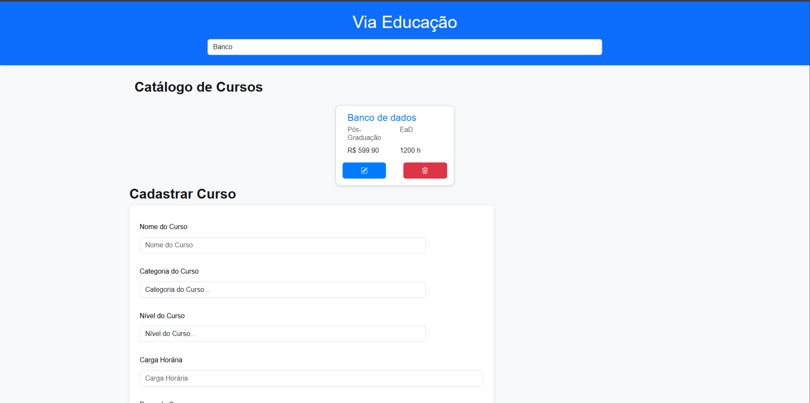

# VIA EDUCAÇÃO

## Objetivo

Via Educação é uma página web com o intuito de possibilitar a apresentação de um catálogo cursos, além de criar novos  cursos, editar e excluir. A página ainda permite mostrar as estatísticas de valores e quantidades de cursos.

## Como utilizar a página

A página pode ser carregada através do endereço: sotu.casa:8080 e todo projeto pode ser visto pelo link: https://github.com/Pattys1lv4/nivelamento_Patr-cia_Silva_Rego.git

A página conta com um layout simples e de fácil uso. 
- Possui uma barra de pesquisa de cursos que permite filtrar por palavras.
- Os cursos cadastrados podem ser visualizados em formato de cards, exibindo o nome do curso, o tipo de nível do curso(Técnico, Graducação e Pós-Graduação), a categoria do curso (Presencial, Semi-Presencial e EaD), seu valor e sua carga horária. Possui também um botão para editar o curso e um botão para deletar.

- Possui formulário para a criação de um novo curso, com os campos: nome, categoria, nível, carga horária e preço.

- Caso os campos não estejam preenchidos, mostrará uma mensagem de erro.

- Caso o curso seja criado, aparecerá uma mensagem de curso criado com sucesso.

- A página ainda permite editar um curso já existente.

- Após a edicação do curso, será apresentado uma mensagem de alteração.

- Nas estatísticas pode-se observar a quantidade total de cursos, o total da carga horária de todos os cursos cadastrados e  quantos cursos gratuitos existem.

## Requisitos Atendidos

- Estrutura e layout: a estrutura foi criada com html e uso referenciais do boostrap para a criação da página.

- Foi criada uma API para o uso da página por: Gustavo Barbosa.

- A parte lógica possui um buscador de cursos por nome, mostra as estatísticas do curso. A parte lógica entra-se modularizada.

- Criou-se a classe Curso com id, nome, categoria, carga, nível e preço.

- No formulário ao se criar um novo curso com todos os dados inseridos corretamente, surgirá uma mensagem de "Curso criado com sucesso", caso algum campo não seja inserido, aparecerá uma mensagem de erro.

- O CSS permitiu a estilização e melhor perfomance da tela.

